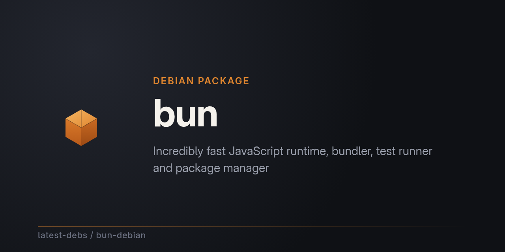

# bun for Debian

[bun](https://github.com/oven-sh/bun) — an incredibly fast JavaScript
runtime, bundler, test runner, and package manager — packaged for Debian as
part of [latest-debs](https://github.com/latest-debs).

## Install

Via the latest-debs apt repository:

```sh
sudo extrepo enable latest-debs
sudo apt update
sudo apt install bun
```

Or download a `.deb` from the [Releases](https://github.com/latest-debs/bun-debian/releases) page:

```sh
sudo dpkg -i bun_*.deb
```

## Supported distributions & architectures

- Debian Bookworm (12), Trixie (13), Forky (14/testing), Sid (unstable)
- amd64, arm64

  (bun's upstream releases only publish glibc amd64/arm64 Linux binaries)

## Building

Run the [Build bun for Debian](../../actions) workflow on GitHub with the
desired upstream version (e.g. `bun-v1.3.14` — note bun's tags include a
`bun-` prefix). Packaging is driven by
[debian-multiarch-builder](https://github.com/ranjithrajv/debian-multiarch-builder).

## Collaborate with us

latest-debs is a community effort. If you rely on this package and want to
help keep it fresh, watching for a new upstream release or fixing a build
hiccup, we'd love your help. Open an issue on this repo, or email
**latest-debs@users.noreply.github.com** to get involved.

## Disclaimer

Unofficial packaging only. For issues with bun itself, see
[oven-sh/bun](https://github.com/oven-sh/bun).
